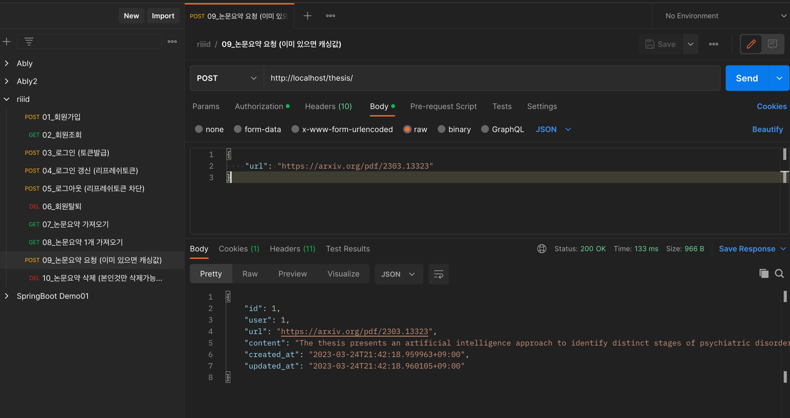
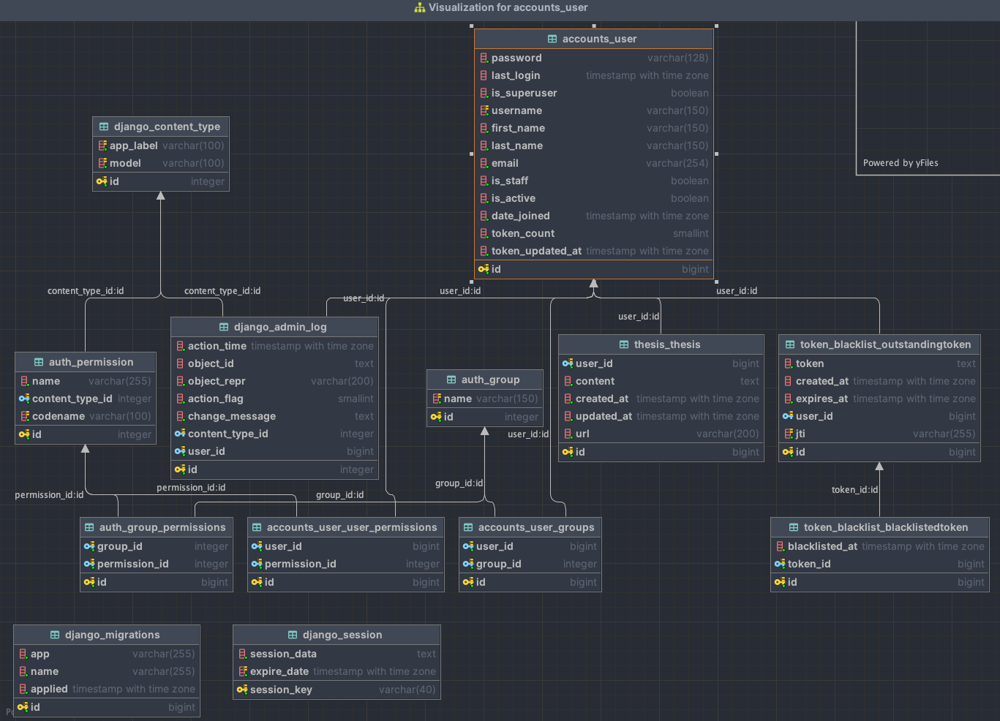
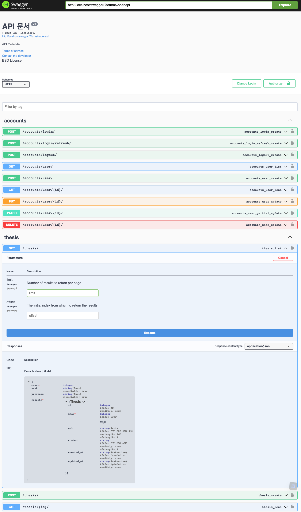

# 코드 실행
1. `docker-compose up -d`
   - 실행전, 본인 로컬에서 8000, 5432, 6379, 80번 포트 사용중인걸 모두 종료해주세요.

# 환경
1. python 3.11.2
2. django 4.1.7 (port: 8000)
3. redis (port: 6379)
4. postgreSQL (port: 5432)
5. nginx (port: 80)

# API 명세 테스트 for Postman
- postman - import - riiid_api_list_postman.json

# ERD

# API 목록
1. 회원가입
2. 회원조회
3. 로그인 (토큰)
4. 로그인 갱신
5. 로그아웃
6. 회원탈퇴 (soft_delete)
7. 논문요약 목록 가져오기 (내것만)
8. 논문요약 1개 가져오기
9. 논문요약 요청하기 (토큰소모, 이미있으면 캐싱값 리턴)
10. 논문요약 삭제 (본인것만 삭제가능 - 인가)

# 요구사항
- [x] API
- [x] 인프라 구성 (django, postgres, redis, nginx)
- [x] 토큰 부족하면 에러 리턴
- [x] 토큰 하루에 한번 로그인시 지급
- [x] Swagger
- [x] test code
  - mocking 처리

# 고도화 계획
1. chatGPT API 요청시 응답시간이 오래 걸리므로, celery를 활용한 비동기처리
2. 서비스 요구사항을 세분화하여 비즈니스 로직을 모두 fat model 기반으로 고도화
3. 테스트 코드를 E2E, 통합테스트, 유닛테스트 단위로 모두 세분화 (현재는 E2E 테스트 작성)
4. 나중에 요약된 논문을 전체 검색할 때, 내용을 위주로 검색해야 하므로 검색엔진 ElasticSearch 도입으로 검색 성능 향상 고도화
5. django-debug-toolbar 를 붙이고, 쿼리최적화 (ORM)
6. 테스트코드에서 redis 호출부분과 OpenAI 부분은 모킹처리하였습니다. 추후 레디스는 테스트코드 실행시 테스트코드 실행환경의 redis 띄우는 방법찾기

# 고민
1. 디렉토리 구조를 django convention을 따라가야 하는지, fastapi, springboot 처럼 레이어드 아키텍처로 가야하는지 고민했습니다.
2. 요구사항 파일에 샘플 디렉토리 구조를 보고 FastAPI 를 사용하여 구현할까 하다가 사용한적이 얼마 없어 가장 익숙한 django를 택했습니다.
   - 위 결정으로 인해, django에서 개발하는방식으로 진행하다보니 레이어드 아키텍처 기반으로 폴더구조를 작성하진 않았습니다.
   - 하라고하면, 할 순 있을것 같으나, 한정된 시간안에 정해진 구현 요구사항들이 많다보니 굳이 도전을 하진 않았습니다.
3. 논문요약을 한국어로 응답해야 한다는 요구사항 같은것이 존재하지않아, 영어로 요약해도록 했습니다.
   - 한국어로 응답요청시, 레이턴시가 증가합니다.
4. 토큰 지급 기준은 마지막 로그인 기준 하루이상 지날 시 지급하도록 작성했습니다. (하루 한번 0시에 초기화해야 되는지 헷갈려서 이렇게 작성했습니다.)
5. 테스트코드에서 redis, openAI 외부 연동 호출 부분을 어떻게 처리하는지 고민하다 mocking 방법으로 결국 진행했습니다.

# 주의사항
1. `.env` 파일에 제 개인 OpenAI api key가 등록되어있으니, 테스트 용도로만 사용해주시고 과제 채점후 삭제부탁드립니다. (모니터링중...)

# Swagger
- `http://localhost/swagger`

